UNIVERSITATEA DE STAT DIN MOLDOVA

FACULTATEA „MATEMATICĂ ŞI INFORMATICĂ”

DEPARTAMENTUL“INFORMATICĂ APLICATA”

Framework
# Lucrare de laborator nr. 3.
Bazele lucrului cu baze de date în Laravel

`                                `Realizat : Caisin Valeria

`                              `Grupa: IA2201

`                                `Verificat: Nichita Nartea

Chişinău 2024
## **Condiții:**
### **1. Pregătirea pentru lucru**
Configurați variabilele de mediu în fișierul .env pentru a vă conecta la baza de date:

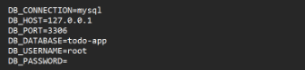

### **2. Crearea modelelor și migrațiilor** 
Definirea structurii tabelei category în migrație:

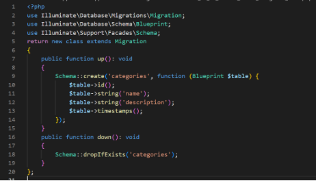

Definirea structurii tabelei task în migrație:

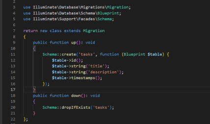

Definirea structurii tabelei tag în migrație:

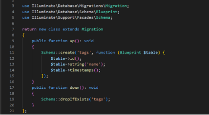

Adăugați câmpul $fillable în modelele Task, Category și Tag pentru a permite atribuirea în masă a datelor.

![ref1]![ref2]

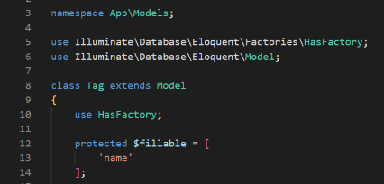

### ` `**3. Relația dintre tabele**

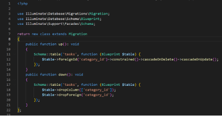

` `În modelul Category adaugăm relația cu Task

![ref3]

În modelul Task adaugăm relația cu Category:

![ref4]
#### Creați o tabelă intermediară pentru relația de tipul multe-la-multe dintre sarcini și etichete:

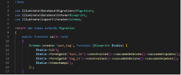

` `Adaugam relația multe-la-multe in Taks si Tag:

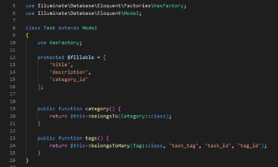

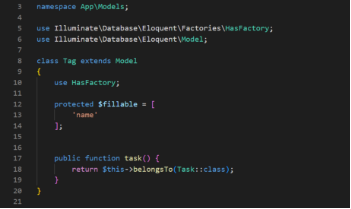

Definirea structurii corespunzătoare a tabelei în migrație.

` `Actualizează fișierul de migrare pentru a defini structura tabelei task\_tag:

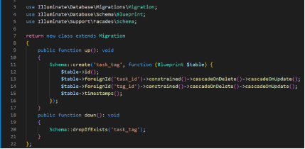

**4. Relațiile dintre modele**

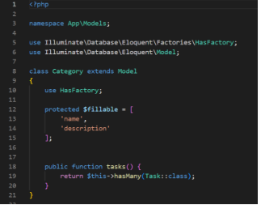

Adăugați relații în modelul Task

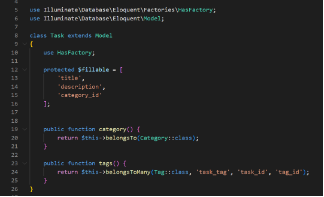

Relația în modelul Tag

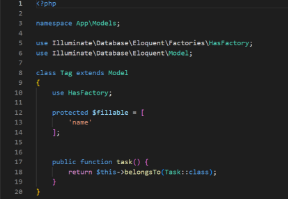

**5.Crearea fabricilor și seed-urilor 

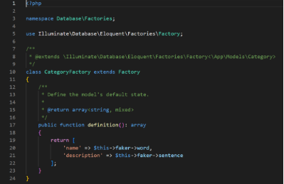

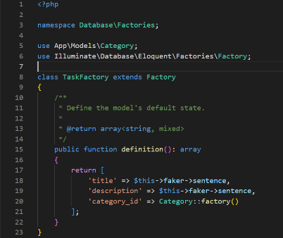**

` `Creați o fabrică pentru modelul Tag

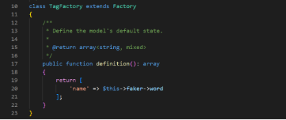

` `Creați seed-uri pentru a popula tabelele cu date inițiale pentru modelele Category, Task, Tag

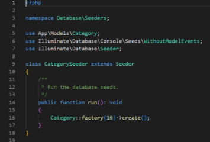

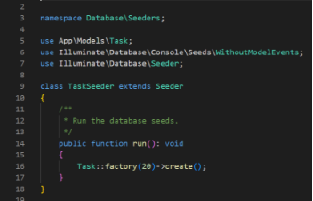

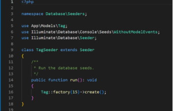

**6. Lucrul cu controlere și vizualizări**

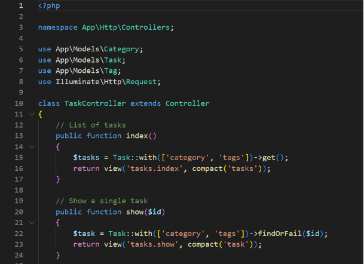

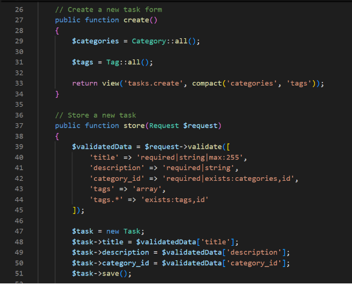

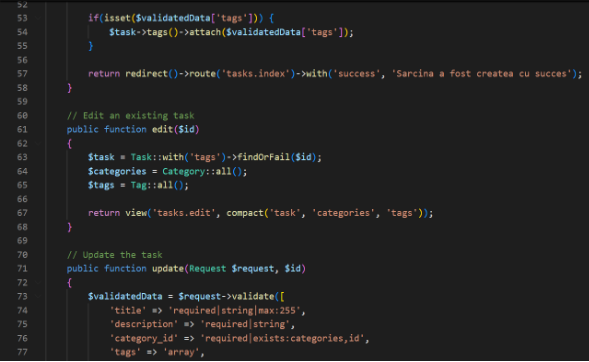

**Întrebări de control**

**1. Ce sunt migrațiile și la ce se folosesc?**

Migrațiile sunt o componentă esențială în gestionarea bazei de date în cadrul unui proiect de dezvoltare. Ele reprezintă fișiere care definesc structura și modificările tabelelor din baza de date, permițând controlul asupra evoluției bazei de date prin cod. Migrațiile se folosesc pentru:

- Crearea tabelelor și a relațiilor dintre ele.
- Modificarea sau actualizarea structurii existente (adăugare de coloane, schimbarea tipului de date, ștergerea tabelelor).
- Reproducerea bazei de date la diferite versiuni sau rollback în caz de erori, pentru a menține consistența între baze de date și cod.

**2. Ce sunt fabricile și seed-urile și cum simplifică procesul de dezvoltare și testare?**

Fabricile sunt șabloane pentru generarea automată a datelor de test, definind structura de bază a datelor pentru un model. Seed-urile sunt scripturi care populează baza de date cu date predefinite. Fabricile și seed-urile simplifică procesul de dezvoltare și testare prin:

- Generarea rapidă de date de test, eliminând nevoia de a introduce manual informații în baza de date.
- Crearea unui set de date consistente și repetabile pentru teste, permițând reproducerea erorilor și asigurând acuratețea testelor.
- Simplificarea inițializării bazei de date pentru noi membri ai echipei de dezvoltare.

**3. Ce este ORM? Care sunt diferențele dintre pattern-urile DataMapper și ActiveRecord?**

ORM (Object-Relational Mapping) este o tehnologie care facilitează interacțiunea dintre baza de date și codul aplicației, permițându-le dezvoltatorilor să manipuleze datele ca obiecte, în loc să scrie interogări SQL directe. ORM mapează tabelele din baza de date la clase din codul aplicației și înregistrările din tabele la instanțe ale acelor clase.

Diferențele dintre pattern-urile DataMapper și ActiveRecord:

- ActiveRecord: Este un pattern în care fiecare obiect reprezintă o singură înregistrare din baza de date și conține metode pentru a salva, șterge sau încărca acea înregistrare. Modelele din ActiveRecord gestionează atât datele, cât și logica interacțiunii cu baza de date (de exemplu, Laravel).
- DataMapper: Separă obiectele de logica de persistență. Astfel, obiectele nu știu cum să interacționeze cu baza de date, această sarcină fiind delegată unui "mapper" care transformă obiectele în interogări și invers. DataMapper este mai complex, dar oferă mai multă flexibilitate și separare a preocupărilor (de exemplu, Doctrine ORM în PHP).

**4. Care sunt avantajele utilizării unui ORM comparativ cu interogările SQL directe?**

Utilizarea unui ORM are următoarele avantaje:

- Abstracția bazei de date: ORM oferă o interfață abstractizată, permițând lucrul cu obiecte în loc de interogări SQL, ceea ce face codul mai intuitiv și ușor de întreținut.
- Compatibilitate între baze de date: ORM-urile suportă mai multe tipuri de baze de date, permițând comutarea între baze de date fără modificări majore de cod.
- Securitate: ORM-urile implementează mecanisme de prevenire a atacurilor SQL injection prin utilizarea de interogări parametrizate.
- Automatizare: Operațiunile CRUD sunt simplificate, iar relațiile între tabele pot fi gestionate prin metode în loc de interogări manuale.

**5. Ce sunt tranzacțiile și de ce sunt importante în lucrul cu bazele de date?**

Tranzacțiile sunt unități de execuție atomică în baza de date, asigurând că mai multe operațiuni sunt executate complet sau nu sunt executate deloc. În cadrul unei tranzacții, dacă o parte din operațiuni eșuează, toate modificările sunt anulate (rollback), astfel încât baza de date să rămână într-o stare consistentă. Tranzacțiile sunt esențiale pentru:

- Consistența datelor: Previn stări corupte în baza de date în cazul unei erori.
- Gestionarea corectă a concurenței: Asigură că mai multe utilizări concurente ale bazei de date nu provoacă conflicte sau date incorecte.
- Siguranța operațiunilor: Sunt folosite pentru acțiuni critice, cum ar fi tranzacțiile financiare sau modificările importante de date.

[ref1]: Aspose.Words.6a606776-0c67-4601-81e0-00b0cf00b9a8.005.png
[ref2]: Aspose.Words.6a606776-0c67-4601-81e0-00b0cf00b9a8.006.png
[ref3]: Aspose.Words.6a606776-0c67-4601-81e0-00b0cf00b9a8.009.png
[ref4]: Aspose.Words.6a606776-0c67-4601-81e0-00b0cf00b9a8.010.png
